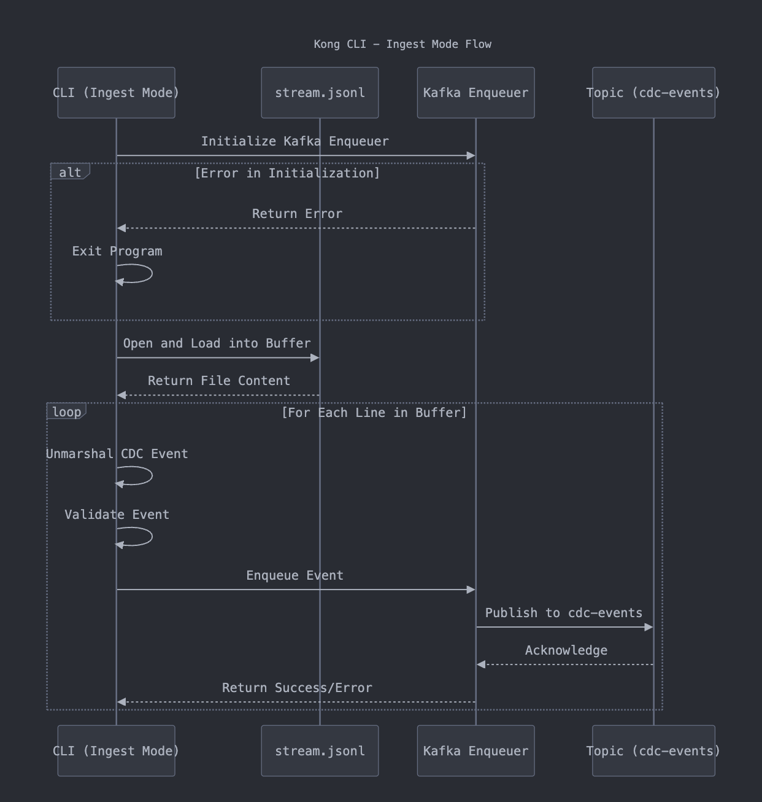
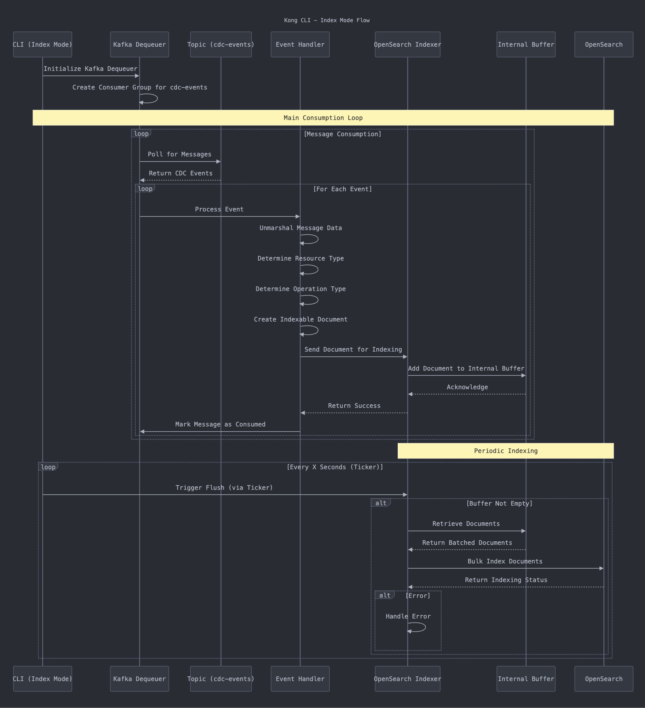

# Konnet Exercise

## Solution

I've built a Go-based CLI application that operates in two distinct modes: ingest and index. This creates a pipeline for processing Change Data Capture (CDC) events.

### Ingest Mode

```
make run-ingest
```

In ingest mode, the application acts as a producer by:

1. Initializing a Kafka enqueuer
2. Reading CDC events from a local stream.jsonl file
3. Validating and unmarshaling each event
4. Publishing validated events to a Kafka topic named "cdc-events"

### Index Mode

```
make run-index
```

In index mode, the application functions as a consumer by:

1. Setting up a Kafka consumer group subscribed to the "cdc-events" topic
2. Processing incoming events through a custom handler that:

   - Unmarshals the message data
   - Determines resource and operation types
   - Transforms events into indexable documents

3. Batching documents for efficient indexing
4. Using a timed approach (ticker) to periodically flush batched documents to OpenSearch via the bulk API

This event-driven approach effectively decouples the ingestion and indexing processes, allowing for scalable, asynchronous processing of CDC events while maintaining data consistency through the Kafka message queue.

## Diagrams

### Ingestion Diagram



### Indexing Diagram



---

# Original Instructions

## Problem

We are building a search bar that lets people do fuzzy search on different Konnect entities (services, routes, nodes).
you're in charge of creating the backend ingest to power that service built on top of a [CDC stream](https://debezium.io/documentation/reference/stable/connectors/postgresql.html#postgresql-create-events) generated by Debezium

We have provided a jsonl file containing some sample events that can be used to
simulate input stream.

Below are the tasks we want you to complete.

- develop a program that ingests the sample cdc events into a Kafka topic
- develop a program that persists the data from Kafka into Opensearch

## Get started

Run

```
docker-compose up -d
```

to start a Kakfa cluster.

The cluster is accessible locally at `localhost:9092` or `kafka:29092` for services running inside the container network.

You can also access Kafka-UI at `localhost:8080` to examine the ingested Kafka messages.

Opensearch is accessible locally at `localhost:9200` or `opensearch-node:9200`
for services running inside the container network.

You can validate Opensearch is working by running sample queries

Insert

```
curl -X PUT localhost:9200/cdc/_doc/1 -H "Content-Type: application/json" -d '{"foo": "bar"}'
{"_index":"cdc","_id":"1","_version":1,"result":"created","_shards":{"total":2,"successful":1,"failed":0},"_seq_no":0,"_primary_term":1}%
```

Search

```
curl localhost:9200/cdc/_search  | python -m json.tool
  % Total    % Received % Xferd  Average Speed   Time    Time     Time  Current
                                 Dload  Upload   Total   Spent    Left  Speed
100   223  100   223    0     0  41527      0 --:--:-- --:--:-- --:--:-- 44600
{
    "took": 1,
    "timed_out": false,
    "_shards": {
        "total": 1,
        "successful": 1,
        "skipped": 0,
        "failed": 0
    },
    "hits": {
        "total": {
            "value": 1,
            "relation": "eq"
        },
        "max_score": 1.0,
        "hits": [
            {
                "_index": "cdc",
                "_id": "1",
                "_score": 1.0,
                "_source": {
                    "foo": "bar"
                }
            }
        ]
    }
}
```

Run

```
docker-compose down
```

to tear down all the services.

## Resources

- `stream.jsonl` contains cdc events that need to be ingested
- `docker-compose.yaml` contains the skeleton services to help you get started
